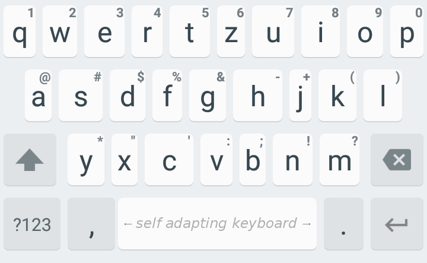

# Self Adapting Keyboard

      
Tired of typos? Sick of missing the keys on your tiny smartphone keyboard? This Android keyboard automatically learns an optimal keyboard layout fitted to your individual typing style! Keys will be positioned and sized in an optimal way to reduce your mistyping rate. Just start using the keyboard and after some typing you'll notice the keyboard adapting its layout on its own.

## Features

- Automatically learns your individual optimal keyboard layout
- On-device machine learning backed by current research
- Your data is yours - and only yours! No usage data is sent anywhere.
- Minimal permissions (only Vibrate)
- Small size (<1MB)
- Ads-free

## How to install

Download the most recent .apk from [here](https://github.com/mkirchhof/self-adapting-keyboard/releases) and install it on your device. Once installed, activate the keyboard in your device's settings and choose it as your primary keyboard by clicking on the small keyboard symbol in the bottom right edge of your screen ([Tutorial](https://support.swiftkey.com/hc/en-us/articles/201591521-How-do-I-switch-between-and-manage-my-keyboards-)). After a short while, you'll notice the keyboard adapting to your personal typing style.

## Privacy on a third-party keybard?

I'm a huge supporter of privacy - especially when it comes to intimate data such as what you type on your phone. That's why I put all of this app's source code openly available here. The app has no permissions for internet or file-system access. All data this app stores is saved in the app's secure memory so that no other app or user has access to it. Note: if you use a rooted device, malicious apps might invade this storage, which is why I do not recommend using this app on a rooted device.

## Can you implement Swype/Autocorrection/Word prediction?
I'm afraid I don't have the time to implement all these features into the app, as it's only a hobby project. My plan is to keep this app a prototype that shows this one feature - and hope that other keyboard app developers will see it and implement it into their apps, too! So if you'd like to see this self-adaption feature in your favourite keyboard app, I'd be honored if you sent the devs a link to this github page and ask them to implement it :)

## If you're a developer yourself:

I'd love to see you implementing this self-adaption mechanism into your own keyboard apps! I'll soon upload a high-level documentation of the code and links to some research on how to optimally implement it. Be sure to send me a mail if you do implement this functionality as I'd love to try out your apps, too :)

## Credits

Licensed under Apache License Version 2.

This keyboard is based on the [Simple Keyboard](https://github.com/rkkr/simple-keyboard), which in turn is based on the AOSP LatineIME keyboard. You can get the original source code in https://android.googlesource.com/platform/packages/inputmethods/LatinIME/
